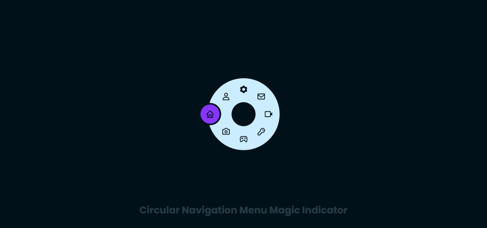

# 🌀 Circular Navigation Menu (Magic Indicator)

A **circular navigation interface** featuring a **rotating magic indicator** and a dynamic toggle animation.
Built with **HTML**, **CSS**, and **Vanilla JavaScript**, this UI showcases circular geometry, transform logic, and interactive state transitions.

🔗 **[Live Demo](https://nsnet21.github.io/16-circular-navigation-menu-magic-indicator/)**

---

## 🖼️ Preview



---

## 🚀 Features

- 🧭 **Circular Menu Layout** — 8 icons evenly spaced along a perfect circle
- 🪄 **Magic Indicator** — animated highlight circle that rotates with the active icon
- 🎛️ **Expandable / Collapsible Menu** — toggle button with plus rotation effect
- 🎨 **Gradient Accent Theme** — cool purple-blue tones with subtle contrast
- ⚡ **Smooth Motion Transitions** — animated with cubic-bezier and transform-origin logic
- 💡 **Pure Front-End Implementation** — no libraries, just native web tech

---

## 🧰 Built With

| Stack                      | Usage                                                    |
| :------------------------- | :------------------------------------------------------- |
| **HTML5**                  | Menu structure & toggle logic                            |
| **CSS3**                   | Circular layout, transform-based animation, color system |
| **Vanilla JavaScript**     | Toggle control, active item management                   |
| **Boxicons**               | Icon library for visual consistency                      |
| **Google Fonts (Poppins)** | Typography styling                                       |

---

## 🧠 How It Works

1. The `.menu` is a **circular container** (`300×300px`) with items positioned using
   `transform: rotate(calc(360deg / 8 * var(--i))) translateX(42px)`.
2. The `toggle` button in the center (`.bx-plus`) expands or collapses the menu using class toggles.
3. Each `<li>` receives a CSS variable `--i` that determines its rotational angle.
4. The `.indicator` element tracks the active menu item using rotation logic tied to `nth-child()`.
5. JavaScript handles:
   - The toggle effect (`menu.classList.toggle("active")`)
   - The active-state switching
   - Temporary blocking of transitions for smoother reset motion

---

## 📄 File Structure

```
16Circular-Navigation-Menu-Magic-Indicator/
│
├── assets-preveiw/
│ └── preview.jpeg
├── index.html
├── style.css
├── script.js
├── README.md
├── .gitignore
└── .gitattributes
```

---

## 🎨 Color Palette

| Variable           | Description        | Example              |
| :----------------- | :----------------- | :------------------- |
| `--accent-400`     | Main purple accent | `rgb(136, 53, 253)`  |
| `--background-950` | Deep background    | `rgb(0, 17, 26)`     |
| `--background-100` | Light toggle base  | `rgb(204, 237, 255)` |
| `--text-100`       | Text subtle tone   | `rgb(204, 240, 255)` |

The palette creates strong contrast between **accent** (focus indicator) and **background**, giving the glowing effect more clarity.

---

## 💡 Learning Focus

- Circular layout design using **`transform-origin`**
- Toggle & active state animation using **class-based logic**
- Using **CSS variables (`--i`)** to calculate precise positions dynamically
- Coordinating JS state and CSS transitions seamlessly
- Transition blocking & timing correction for smooth animation resets

---

## 📘 Technical Notes

### 🔹 1. Circular Positioning Formula

Each menu item is placed evenly along a circle using:

```css
transform: rotate(calc(360deg / 8 * var(--i))) translateX(42px);
```

- `360deg / 8` = 45° interval per item
- `translateX(42px)` moves the icon outward from the center
- `transform-origin: 150px` ensures all icons orbit around the same point
  This creates a mathematically perfect circular layout.

  ***

### 🔹 2. Active State & Indicator Logic

When an item becomes `.active`, the `.indicator` rotates using sibling selectors:

```css
.menu.active li:nth-child(3).active ~ .indicator {
  transform: translateX(-102px) rotate(calc(360deg / 8 * 1));
}
```

- Each active item triggers a **rotation** of the indicator.
- The indicator’s `::before` pseudo-element holds the highlight circle.
- `transform-origin: right` allows the pivot to stay at the center.

  The result: an _**orbiting highlight**_ that locks perfectly to each icon position.


---

### 🔹 3. Blocking Transition for Sync Reset

When toggling the menu:

```js
indicator.classList.add("block-transition");
list[i].classList.add("block-transition");
```

This prevents unwanted animation flicker when the menu collapses or reopens. </br>
After 300ms (using `setTimeout`), the blocking class is removed — giving a smooth “reset → expand → active” flow.

---

### 🔹 4. Toggle Button Rotation

The center “plus” icon rotates `315°` to visually indicate menu expansion:

```css
.menu .toggle.active {
  transform: rotate(315deg);
}
```

While `::after` scales outward with `scale(3)` to create a subtle **expanding ripple** background.

---

### 🧮 Motion Math Behind The Indicator

Let:

- `n` = index of item (0–7)
- `θ = 360° / 8 = 45°`
- `R = 102px` (indicator radius)

Then the position of the indicator =

```css
translateX(-R) rotate(θ × n)
```

This gives perfectly even rotation intervals and ensures that the highlight moves **in sync with each menu item’s angular position**.

### 🔧 Future Improvements

- 📱 Add responsive scaling for smaller screens
- 🌈 Add glow/ripple hover feedback on each icon
- 🔄 Smooth easing transitions for rotation interpolation
- 🎚️ Add color theme switch (light / dark / accent mode)

---

### 📚 License

This project is open-source for learning, creative exploration, and portfolio display. </br>
Feel free to fork, remix, and expand.

**Created by [Nate](https://github.com//NSNet21)**
🔥 Exploring the geometry of motion and the art of circular UI design.
